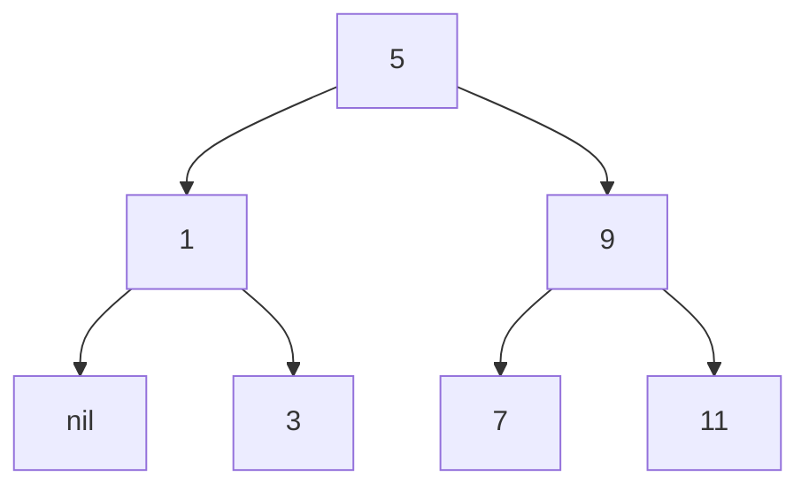
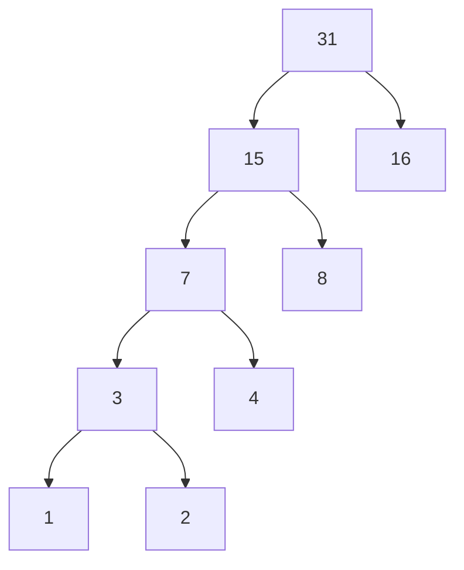

**练习2.53**

```scheme
(a b c)
((george))
((y1 y2))
(y1 y2)
#f
#f
(red shoes blue socks)
```

**练习2.54**

列表相等判断

```
(define (equal? lst1 lst2)
  (cond ((and (null? lst1) (null? lst2)) true)
        ((or (null? lst1) (null? lst2)) false)
        ((not (eq? (car lst1) (car lst2 ))) false)
        (else (equal? (cdr lst1) (cdr lst2)))
        )
  )
```

**练习2.55**

`''abracadabra`等价于(quate (quate abracadabra))`，`所以对`（car  (quate (quate abracadabra)))`求值等价于取列表`(quate abracadabra)`的第一项，即`quate`

**练习2.56**


```scheme
(define (exponentition? x)
 (and (pair? x) (eq? (car x) '**)) )

(define (base s)
  (cadr s))

(define (exponent s)
  (caddr s))

(define (deriv exp var)
  (cond ((number? exp) 0)
        ((variable? exp)
         (if (same-variable? exp var) 1 0))
        ((sum? exp)
         (make-sum (deriv (addend exp) var)
                   (deriv (augend exp) var)))
        ((product? exp)
         (make-sum
          (make-product (multiplier exp)
                        (deriv (multiplicand exp) var))
          (make-product
                        (deriv (multiplier exp) var)
                        (multiplicand exp))))
         
        ((exponentition? exp)
         (make-product (exponent exp)
                        (make-product (make-exponentition (base exp)
                                                          (make-sum (exponent exp) -1))
                                      (deriv (base exp) var)))
         )
        (else (error "unknown exp --deriv" exp) )
        
        
   )
  
)
```

**练习2.57**

若`exp`为`’(+ 1 2 3)` ，augend返回`'(+ 1 2)`。若为`‘(+ 1 2)`，返回`2`。

multiplicand同理。

```scheme
(define (augend s)
  (let ((rest (cddr s)))
        (if (eq? (cdr rest) '())
            (car rest)
            (cons '+ rest)))
  )
  
(define (multiplicand s)
  (let ((rest (cddr s)))
        (if (eq? (cdr rest) '())
            (car rest)
            (cons '* rest)))
  )
```

**练习2.58**

a)两个操作数的中缀表达式

```scheme
(define (exponentition? x)
 (and (pair? x) (eq? (cadr x) '**)) )

(define (base s)
  (car s))

(define (exponent s)
  (caddr s))


(define (=number? exp num)
  (and (number? exp) (= exp num)))


(define (make-exponentition base exponent)
  (cond ((=number? base 0) 0)
        ((=number? exponent 1) base)
        (else (list  base '** exponent))))

(define (make-sum a1 a2)
  (cond ((=number? a1 0) a2)
        ((=number? a2 0) a1)
        ((and (number? a1) (number? a2)) (+ a1 a2))
        (else (list  a1 '+ a2))))
(define (sum? x)
  (and (pair? x) (eq? (cadr x) '+))
  )
(define (addend s) (car s))
(define (augend s)
  (caddr s))

(define (make-product a1 a2)
  (cond ((or (=number? a1 0) (=number? a2 0) ) 0)
        ((=number? a1 1) a2)
        ((=number? a2 1) a1)
        ((and (number? a1) (number? a2)) (* a1 a2))
        (else (list  a1 '* a2))))
(define (product? x)
  (and (pair? x) (eq? (cadr x) '*)))

(define (multiplier p) (car p))
(define (multiplicand s)
  (caddr s))

```

b)不写不必要括号的中缀表达式

 未考虑指数情况和s-表达式不会合法的情况

思路：对每个列表项进行`transfer`。转换后列表可表示为`（a1 a2 a3 ...`。若第3项为`+`，则返回`(a1 + (tranfer a3...)`。若为`*`,返回`((a1 * a3) a4 (transfer a5...) )`

```scheme
(define (transfer s)
  (if (or  (null? s) (not (pair? s)))
      s
      (if (eq? (cdr s) '())
          (car s)
          (let ((ts (map (lambda (x) (transfer x)) s)))
            (cond ((= (length ts) 3) ts)
                  ((eq? (cadr ts) '+) (list (car ts) '+ (transfer (cddr ts))))
                  ((eq? (cadr ts) '*) (list (list (car ts) '* (caddr ts))
                                             (cadddr ts)
                                             (transfer (cddddr ts)))) 
            )
          )
       )
   )
)
```

**练习2.59**

```scheme
(define (union-set set1 set2)
  (cond ((and (null? set1) (null? set2)) '())
        ((null? set1) set2)
        ((null? set2) set1)
        ((not (element-of-set? (car set1) set2))
         (cons (car set1)
               (union-set (cdr set1) set2)))
        (else (union-set (cdr set1) set2))
        )
  )
```

**练 习2.60**

`element-of-set?`函数不变，`adjoin-set`无需判断直接`cons`加入，对于`union-set`和`intersection-set`则需要在返回前去重。

```scheme
;列表去重
(define (deduplication items)
  (define (iter cur res)
     (if (null? cur)
         res
         (if (element-of-set? (car cur) res)
             (iter (cdr cur) res)
             (iter (cdr cur) (cons (car cur) res)))))
  (reverse (iter items '()))
)

```

适合插入多，求并集交集少的场景

**练习2.61**

```scheme
(define (adjoin-sorted-set x set)
  (if (null? set)
      (cons x set)
      (let ((cur (car set))
            (rest (cdr set)))
        (cond ((= x cur) set)
              ((> x cur) (cons cur (adjoin-sorted-set x rest)))
              ((< x cur) (cons x (cons cur rest)))
              )
      )
  )
)
```

**练习2.62**

```scheme
(define (union-sorted-set set1 set2)
  (cond ((and (null? set1) (null? set2)) '() )
        ((null? set1) set2)
        ((null? set2) set1)
        (else (let ((x1 (car set1))
                    (x2 (car set2)))
                (cond ((= x1 x2)
                       (cons x1 (union-sorted-set (cdr set1) (cdr set2))))
                      ((< x1 x2)
                       (cons x1 (union-sorted-set (cdr set1) set2)))
                      ((> x1 x2)
                       (cons x2 (union-sorted-set set1 (cdr set2))))
                      )))
        )
  )
```

**练习2.63**

a)两个过程都产生中序遍历序列。对于图2.16中的三棵树，两过程都输出`(1 3 5 7 9 11)`

b)时间复杂度均为`O(n)`

**练习2.64**

a)将序列前n个元素转换成平衡二叉树等价于组合前（n-1）/2个元素转化成的平衡二叉树（左子树）、第（n-1）/2+1个元素（根）和剩余元素转成的平衡二叉树（右子树）。终止条件为n等于0,返回nil

（1 3 5 7 9 11）转化成以下二叉平衡树



b)时间复杂度为`O(n)`

**练习2.65**

将树转化成有序列表后，用归并法完成并集或交集

```scheme
;交集
(define (intersection-tree-set-1 set1 set2)
    (intersection-sorted-set (tree->list-1 set1) (tree->list-1 set2))
  )
;并集
(define (union-tree-set set1 set2)
  (cond ((and (null? set1) (null? set2)) '())
        ((null? set1) (tree->list-1 set2) )
        ((null? set2) (tree->list-1 set1))
        (else (union-sorted-set (tree->list-1 set1) (tree->list-1 set2)) )))
```


**练习2.66**

```scheme
(define (lookup  given-key set)
     (cond ((null? set) '())
        ((= given-key (car (entry set))) (entry set))
        ((< given-key (car (entry set)))
         (lookup given-key (left-branch set)))
        ((> given-key (car (entry set)))
         (lookup given-key (right-branch set)))
        )) 
```


**练习2.67**

`ADABBCA`

**练习2.68**

编码

```scheme
(define (encode message tree)
  (if (null? message)
      '()
      (append (encode-symbol (car message) tree)
              (encode (cdr message) tree)))
  )

(define (include? ch tree)
  (if (null? tree)
      false
      (memq ch (symbols tree))
      )  
)
(define (encode-symbol ch tree)
  (define (iter cur result)
    (if (leaf? cur)
        result
        (let ((left-tree (left-branch cur) )
              (right-tree (right-branch cur)))
          
        (cond ((include? ch left-tree) 
               (cons 0 (iter left-tree result)))
              ((include? ch right-tree) 
               (cons 1 (iter right-tree result)))
              )
          )
    ) 
  )
  ( if (or (null? tree)
           (leaf? tree)
           (not(include? ch tree)))
         (error "fail tree!")
         (iter tree  '()))

)
```

**练习2.69**

生成`huffman`树

```scheme
(define (generate-huffman-tree pairs)
  (successive-merge (make-leaf-set pairs)))

(define (successive-merge trees)
  (define (merge left right)
    (make-code-tree left right))
  (define (iter cur)
    (if (= (length cur) 1)
        cur
        (let ((first (car cur))
              (second (cadr cur))
              (rest (cddr cur)))
          (iter (adjoin-set (merge first second) rest)))))
  (car (iter trees))
)

```


**练习2.70**

使用`huffman`编码需`85`个比特，定长编码需要`36xlog8=108`个

**练习2.71**

当n=5时，Huffman编码树如下



n=10时的与n=5相似，略。

最频繁词的编码长度为1，最不频繁的词编码长度为`n-1`

**练习2.72**

查找最频繁的词时，只需下降一层，左右两个节点符号数之和为`n`。所以时间复杂度为`O(n)`

查找最不频繁的词时，需一直下降到最底层。每下降一层所需检查左右子节点的符号数之和为父节点的符号数，所以累积计算可知总的时间复杂度应为`O(n^2)`

