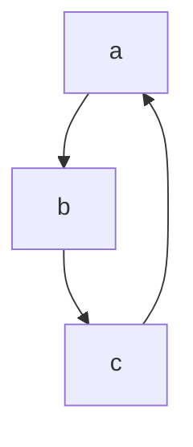

**练习3.12**

`(b)`

`(b c d)`

append没有修改x的结构，而append!修改了x的结构，它变成`（a b c d）`

**练习3.13**

会出现死循环，因为z是一个环形结构,如下图所示



**练习3.14**

mystery实现了反转列表的功能。

反转前，v为`(a b c)`

反转后，w为`(c b a)`，v为（a），v始终指向a开头的结构（列表）

**练习3.15**

set-wow!对z1和z1的作用如下图所示


<center>
    
    <br>
</center>

**练习3.16**

对于count-pairs，分别返回3、4、7或不返回的盒子结构

<center>
    
    <br>
</center>

**练习3.17**

dfs过程中检查当前节点是否己经访问过。若未访问过，即path中不存在，加入path并访问它的两个子节点。

```scheme
define (count-pairs-t x)
  (define path '())
  (define (contain? ele)
    (if (memq ele path) #t #f))
  (define (dfs cur)
   (if (or (not (pair? cur)) (contain? cur))
      0
      (begin (set! path (cons cur path))
             (+ (dfs (car cur))
                (dfs (cdr cur))
                1))
      ))
  (dfs x)
)
```

**练习3.18**

判断是否环形列表

```scheme
(define (loop?  x)
  (define (iter cur idx)
    (cond ((null? cur) #f)
          ((and (eq? cur x) (not (= idx 0))) #t)
          (else (iter (cdr cur) (+ idx 1))))
    )
  (iter x 0)
)

```

**练习3.19**

快慢指针判环

```scheme
(define (loop? lst)
    (define (iter x y)
        (let ((x-walk (list-walk 1 x))
              (y-walk (list-walk 2 y)))
            (cond ((or (null? x-walk) (null? y-walk))
                    #f)
                  ((eq? x-walk y-walk)
                    #t)
                  (else
                    (iter x-walk y-walk)))))
    (iter lst lst))

(define (list-walk step lst)
    (cond ((null? lst)
            '())
          ((= step 0)
            lst)
          (else
            (list-walk (- step 1)
                       (cdr lst)))))
```


**练习3.20**

图较复杂，不想画了。。。

**练 习3.21**

原因是返回值按scheme内置的序列方式打印。

输出队列

```scheme
(define (print-queue queue)
  (if (or (null? queue) (not (pair? queue)))
      (error "this is not a queue!")
      (car queue)))
```

**练习3.22**

消息传递版队列

```scheme
(define (make-queue)
  (let ((front-ptr '())
        (rear-ptr '()))
    (define (set-front-ptr! item) (set! front-ptr item))
    (define (set-rear-ptr! item) (set! rear-ptr item))
    (define (empty-queue? ) (null? front-ptr))

    (define (front-queue )
      (if (empty-queue? )
          (error "FRONT called with an empty queue")
          (car front-ptr)))

    (define (insert-queue! item)
      (let ((new-pair (cons item '())))
        (cond ((empty-queue? )
               (set-front-ptr! new-pair)
               (set-rear-ptr!  new-pair))
              (else
               (set-cdr! rear-ptr new-pair)
               (set-rear-ptr!  new-pair))))) 

    (define (delete-queue!)
      (cond ((empty-queue? )
             (error "DELETE! called with an empty queue" ))
            (else
             (set-front-ptr! (cdr front-ptr)))))
    (define (print-queue ) front-ptr)
    (define (dispatch m)
       (cond ((eq? m 'empty-queue?) empty-queue?)
          ((eq? m 'front-queue) front-queue)
          ((eq? m 'insert-queue!) insert-queue!)
          ((eq? m 'delete-queue!) delete-queue!)
          ((eq? m 'print-queue) print-queue)
          (else (error "Undefined operation -- QUEUE" m)))
       )
    dispatch))
```

**练习3.23**

双向链表实现双端队列

```scheme

(define (make-deque)
  (let ((front (make-node 'front '() '()))
        (rear  (make-node 'rear '() '())))
    (set-next! front rear )
    (set-prev! rear front)
    (cons front rear))
  )

(define (front-ptr queue) (car queue))
(define (rear-ptr queue) (cdr queue))

(define (empty-deque? queue)
  (eq? (next (front-ptr queue))  (rear-ptr queue))
  )

(define (print-deque queue)
  (define (iter cur)
    (if (eq? cur (rear-ptr queue))
        '()
        (cons (item cur) (iter (next cur)))))
  (iter (next (front-ptr queue))))


(define (front-deque queue)
  (if (empty-deque? queue)
      (error "FRONT called with an empty deque" )
      (item (next (front-ptr queue)))))


(define (rear-deque queue)
  (if (empty-deque? queue)
      (error "REAR called with an empty deque" )
      (item (prev (rear-ptr queue)))))


(define (front-insert-deque! queue item)
  (let ((new-node (make-node item '() '()))
        (front (front-ptr queue))
        (next-node (next (front-ptr queue))))
    (set-next! new-node next-node)
    (set-prev! next-node new-node)
    (set-next! front new-node)
    (set-prev! new-node front)
    ))

(define (front-delete-deque! queue)
  (cond ((empty-deque? queue)
          (error "DELETE! called with an empty queue" ))
        (else
         (let ((front (front-ptr queue))
               (n-node (next (front-ptr queue)))
               (nn-node (next (next (front-ptr queue)))))
           (set-prev! nn-node front)
           (set-next! front nn-node)
           (set-next! n-node '())
           (set-prev! n-node '())
           ))))


(define (rear-insert-deque! queue item)
  (let ((new-node (make-node item '() '()))
        (rear (rear-ptr queue))
        (prev-node (prev (rear-ptr queue))))
    (set-next! prev-node new-node)
    (set-prev! new-node prev-node)
    (set-next! new-node rear)
    (set-prev! rear new-node)
    ))

(define (rear-delete-deque! queue)
  (cond ((empty-deque? queue)
          (error "DELETE! called with an empty queue" ))
        (else
         (let ((rear (rear-ptr queue))
               (p-node (prev (rear-ptr queue)))
               (pp-node (prev (prev (rear-ptr queue)))))
           (set-prev! rear pp-node)
           (set-next! pp-node rear)
           (set-next! p-node '())
           (set-prev! p-node '())
           ))))

```

**练习3.24**

将assoc 加入对象中，assoc比较时使用same-key? 。更优实现是先精确匹配后模糊匹配

```scheme
(define (make-table same-key?)
  (let ((local-table (list '*table*)))
    (define (assoc key records)
      (cond ((null? records) false)
            ((same-key? key (caar records)) (car records))
            (else (assoc key (cdr records)))))
    (define (lookup key-1 key-2)
      (let ((subtable (assoc key-1 (cdr local-table))))
        (if subtable
            (let ((record (assoc key-2 (cdr subtable))))
              (if record
                  (cdr record)
                  false))
            false)))
    (define (insert! key-1 key-2 value)
      (let ((subtable (assoc key-1 (cdr local-table))))
        (if subtable
            (let ((record (assoc key-2 (cdr subtable))))
              (if record
                  (set-cdr! record value)
                  (set-cdr! subtable
                            (cons (cons key-2 value)
                                  (cdr subtable)))))
            (set-cdr! local-table
                      (cons (list key-1
                                  (cons key-2 value))
                            (cdr local-table)))))
      'ok)    
    (define (dispatch m)
      (cond ((eq? m 'lookup-proc) lookup)
            ((eq? m 'insert-proc!) insert!)
            (else (error "Unknown operation -- TABLE" m))))
    dispatch))

(define (same-key? given-key key)
  (define tolerance 0.001)
  (< (abs (- key given-key)) tolerance))
  
(define operation-table (make-table same-key?))
(define get (operation-table 'lookup-proc))
(define put (operation-table 'insert-proc!))
```

**练习3.25**

递归实现lookup和insert。要注意可能存在overlap的现象，比如己存在路径a->b，查找路径a和a->b->c均是非法的。

叶子节点判断依赖于值类型，以下实现仅支持number类型，更多类型需扩展。注意不要让叶子为table类型，否则可能出现错误。

```scheme
(define (make-generic-table )
  (let ((local-table (list '*table*)))
    (define leaf? number?)
    (define (assoc key records)
      (cond ((null? records) false)
            ((equal? key (caar records)) (car records))
            (else (assoc key (cdr records)))))

    (define (lookup keys)
      (define (lookup-helper cur-table cur-keys )
        (let ((len-keys (length cur-keys))
              (value-tbl (cdr cur-table)))
          (cond ((and (= len-keys 0) (null? value-tbl)) false)
                ((and (= len-keys 0) (not (null? value-tbl)))
                 (if (leaf? value-tbl)
                     value-tbl
                     false))
                ((and (> len-keys 0) (or (null? value-tbl) (leaf? value-tbl))) false)
                (else
                   (let ((subtable (assoc (car cur-keys) (cdr cur-table))))
                     (if subtable
                         (lookup-helper  subtable (cdr cur-keys))
                         false))) 
                 )
                )
          )
      (lookup-helper local-table keys)
        
      )
    

    (define (insert! keys value)
      (define (insert!-helper cur-table cur-keys value)
        (let ((len-keys (length cur-keys))
              (value-tbl (cdr cur-table)))
          (cond ((and (= len-keys 0) (null? value-tbl)) (set-cdr! cur-table value))
                ((and (= len-keys 0) (not (null? value-tbl)))
                 (if (leaf? value-tbl)
                     (set-cdr! cur-table value)
                     (error "key-path voerlap too short!")))
                ((and (> len-keys 0) (not (null? value-tbl) ) (leaf? value-tbl))
                 (error "key-path overlap too len!"))
                (else
                 (let ((subtable (assoc (car cur-keys) (cdr cur-table))))
                   (if subtable
                       (insert!-helper  subtable (cdr cur-keys) value)
                       (begin (set-cdr! cur-table
                                 (cons (list (car cur-keys))
                                       (cdr cur-table)))
                              (insert!-helper  (cadr cur-table) (cdr cur-keys) value)
                              )))
                 ))
          )
       )
        (insert!-helper local-table keys value)
      )
      
    (define (dispatch m)
      (cond ((eq? m 'lookup-proc) lookup)
            ((eq? m 'insert-proc!) insert!)
            (else (error "Unknown operation -- TABLE" m))))
    dispatch))
```

**练习3.26**

二叉搜索树实现table

```scheme
(define (make-sorted-tree-table )
  (let ((root '()))

    (define (make-tree-node key value left right)
      (list key value left right))
    (define (key-node node) (car node))
    (define (value-node node) (cadr node))
    (define (left-branch node) (caddr node))
    (define (set-left! node value) (set-car! (cddr node) value))
    (define (right-branch node) (cadddr node))
    (define (set-right! node value) (set-car! (cdddr node) value))
    (define (lookup key)
      (define (lookup-helper key cur)
          (cond ((null? cur) false)
                ((=  key (key-node cur)) (value-node cur))
                ((<  key (key-node cur)) (lookup-helper key (left-branch cur)))
                ((>  key (key-node cur)) (lookup-helper key (right-branch cur))))
        )
      (lookup-helper key root)
      )
    (define (insert! key value)

      (define (insert!-helper key value cur)
         (cond ((null? cur) (set! root (make-tree-node key value '() '())))
               ((=  key (key-node cur)) 'exist!)
               ((<  key (key-node cur))
                (cond ((null? (left-branch cur))
                       (set-left! cur (make-tree-node key value '() '())))
                      (else (insert!-helper key value (left-branch cur)))))
                
               ((>  key (key-node cur))
                (cond ((null? (right-branch cur))
                       (set-right! cur (make-tree-node key value '() '())))
                      (else (insert!-helper key value (right-branch cur)))))
                ))
      (insert!-helper key value root))
        
          
    (define (dispatch m)
      (cond ((eq? m 'lookup-proc) lookup)
            ((eq? m 'insert-proc!) insert!)
            (else (error "Unknown operation -- TABLE" m))))
    dispatch))

```

**练习3.27**

**练习3.28**

与门实现

```scheme
(define (or-gate a1 a2 output)
  (define (or-action-procedure)
    (let ((new-value
           (logical-or (get-signal a1) (get-signal a2))))
      (after-delay or-gate-delay
                   (lambda ()
                     (set-signal! output new-value)))))
  (add-action! a1 or-action-procedure)
  (add-action! a2 or-action-procedure)
  'ok)


(define (logical-or s1 s2)
 (if (or (= s1 1) (= s2 1)) 1 0))
```

**练习3.29**

用与门和非门实现或门

```scheme
(define (or-gate a b output)
  (let ((inv-a (make-wire)) (inv-b (make-wire)) (and-inva-invb (make-wire)))
    (inverter a inv-a)
    (inverter b inv-b)
    (and-gate inv-a inv-b and-inva-invb)
    (inverter and-inva-invb output))
    'ok)

```

时延为`and-gate-delay+2*invert-gate-delay`

**练习3.30**

```scheme
(define (ripple-carry-adder list-A list-B list-S C)
    (define (iter A B S pre-C)
        (if (and (null? A) (null? B) (null? S))
            'ok
            (let ((Ak (car A))
                  (Bk (car B))
                  (Sk (car S))
                  (remain-A (cdr A))
                  (remain-B (cdr B))
                  (remain-S (cdr S))
                  (Ck (if (null? (cdr A))  C (make-wire))))
                (full-adder Ak Bk pre-C Sk Ck)
                (iter remain-A remain-B remain-S Ck))))
    (iter list-A list-B list-S (make-wire)))
```


全加器中最长路径包含两个非门和和四个与门，所以延时`full-adder-delay=2*inverter-gate-delay+ 4*and_gate_delay`

n位加法由n个全加器级联，延时为`n*full-adder-delay`

以下是错误写法。在使用基本构件组装更大构件的过程中，只需要考虑build，无需关注信号传播，即使用`get-signal`和`set-signal!`。

```scheme

(define (ripple-carry-adder list-A list-B list-S C)
    (define (iter A B S value-of-c)
        (if (and (null? A) (null? B) (null? S))
            'ok
            (let ((Ak (car A))
                  (Bk (car B))
                  (Sk (car S))
                  (remain-A (cdr A))
                  (remain-B (cdr B))
                  (remain-S (cdr S))
                  (Ck (make-wire)))
                (set-signal! Ck value-of-c)
                (full-adder Ak Bk Ck Sk C)
                (iter remain-A remain-B remain-S (get-signal C)))))
    (iter list-A list-B list-S  (get-signal C)))
```

**练习3.31**

对半加器例子，如果不初始化，那么只会输出`carry 11  New-value = 1`

如果不进行初始化，那么将A置1的效应在传递到D点时，E点未初始化仍然为0，这将使输出S为0，传播错误

一般化地说，在效应到达任意一点前，这一点必须在应有的初始状态，否则效应无法继续传播

**练习3.32**

处理事件必须按时间顺序，也就是要先处理时间早的队列，且同一队列先处理先入队的事件（时间更早），同理加入事件也需要按时间顺序加入。

对与门，输入从0，1变成1，0。等价于在定义与门后，执行依次执行`（set-signal! b 1)、（set-signal! a 1）、（set-signal! b 0）`

对于先进先出，此时agenda只有一个时间点5 ，对应的队列为`((set out 0 ) (set out 0) (set out 0) (set out 1) (set out 0))`

而先进后出，也只有一个时间点5，队列为上述队列的反序。

由此可见，这两种情况输出结果是一样的，而执行过程不同。先进后出不遵守时间序。

**练习3.33**

```scheme
(define (averager a b c)
  (let ((u (make-connector))
        (w (make-connector)))
    (multiplier c w u)
    (adder a b u)
    (constant 2 w)
    'ok))
```


**练习3.34**

将b设置值，a不会输出值。原因在于multiplier至少要有两个连接器被置位，另一个才能置位。而这里只有一个连接器b被设置。

**练习3.35**

平方约束`a*a=b`

```scheme
(define (squarer a b)
  (define (process-new-value)
    (cond ((has-value? b)
           (if (< (get-value b) 0)
               (error "square less than 0!" (get-value b))
               (set-value! a (sqrt (get-value b)) me)))
          ((has-value? a) (set-value! b (* (get-value a ) (get-value a)) me))
          ))
  (define (process-forget-value)
    (forget-value! a me)
    (forget-value! b me)
    (process-new-value))
  (define (me request)
    (cond ((eq? request 'I-have-a-value)  
           (process-new-value))
          ((eq? request 'I-lost-my-value) 
           (process-forget-value))
          (else 
           (error "Unknown request -- SQUARE" request))))
  (connect a me)
  (connect b me)
  me)
```

**练习3.36**

**练习3.37**

算术约束版

```scheme
(define (c+ x y)
  (let ((z (make-connector)))
    (adder x y z)
    z))
    
(define (c* x y)
  (let ((z (make-connector)))
    (multiplier x y z)
    z))

(define (c- x y)
  (let ((z (make-connector)))
    (adder z y x)
    z))

(define (c/ x y)
  (let ((z (make-connector)))
    (multiplier z y x)
    z))

(define (cv value)
  (let ((z (make-connector)))
    (constant value z)
    z))
```

