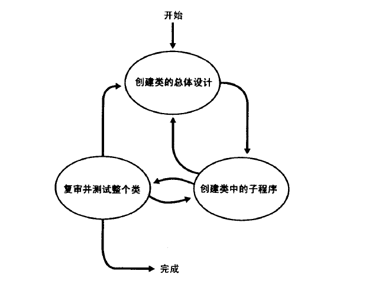
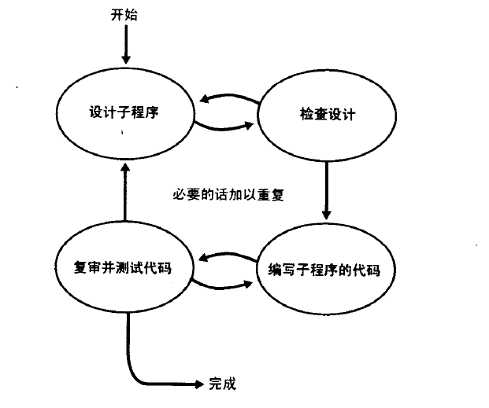

9.1 创建类和子程序的步骤概述

1.创建类的过程

​                                                                                      图1 类的总体设计过程

**创建类的总体设计** 设计一个类的过程中包含一些特有的设计任务----定义类的特定职责，定义类所要隐藏的“秘密”，以及精确地定义类的接口所代表的抽象概念;决定这个类是否要从其他类派生而来，以及是否允许其他类再从它派生；指出这个类中关键的公用方法，标识并设计出类所需用到的重要数据成员。

**创建类的子程序**

**复审并测试整个类**  类创建后，子程序也经过了充分测试。此时，对其整体进行复查和测试，以便发现那些在子程序的独立测试层次上无法测出的问题。

2.创建子程序的过程

​                                                                                              图2 子程序的创建过程

### 9.2 伪代码

伪代码”这个术语是指某种用来描述算法、子程序、类或完整程序的工作逻辑的、非形式的、类似于英语的记法。

特点：

+ 用英语写
+ 与具体编程语言无关
+ 足够低的抽象层次，可直接根据伪代码编写代码

好处： 

+ 方便写注释。
+ 可以在高的抽象层次发现设计错误，避免错误扩散到低层

### 9.3 设计子程序

**定义子程序要实现的功能** 至少要明确:1)隐藏了什么信息；2）输出输出；3）子程序的副作用

**考虑标准库是不是己有的功能**  可使用哪些库来实现子程序的功能

**考虑数据和算法** 没有标准库可用时，考虑可能需要使用何种的数据和算法。

**考虑错误处理** 考虑子程序中可能出错的环节，比如错误的输入或其它子程序返回的错误数据

**考虑效率** 只在两种情况下考虑效率问题：1）子程序己经封装的足够好，对内部实现进行优化；2）子程序与稀缺的资源有关（受限的内存等）

**编写伪代码** 

9.4编写子程序

将伪代码逐行传化成某一具体语言的代码。

